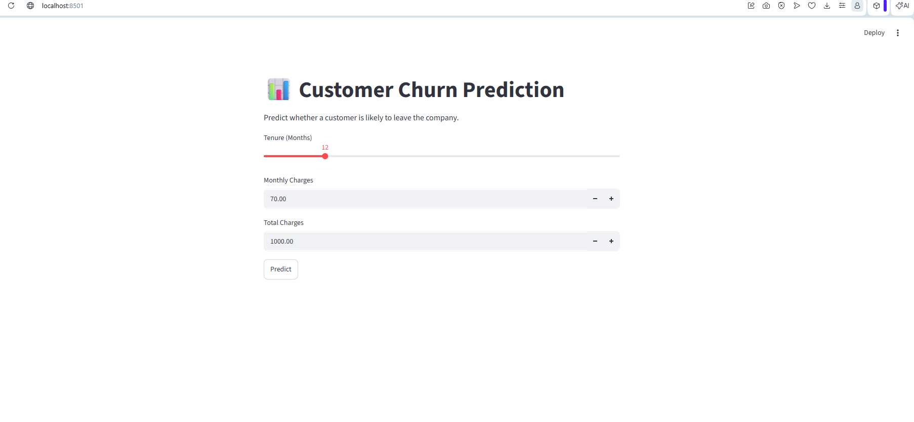
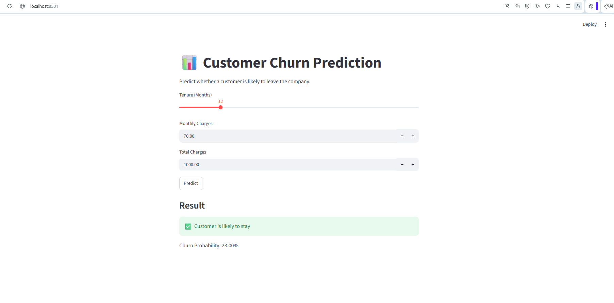
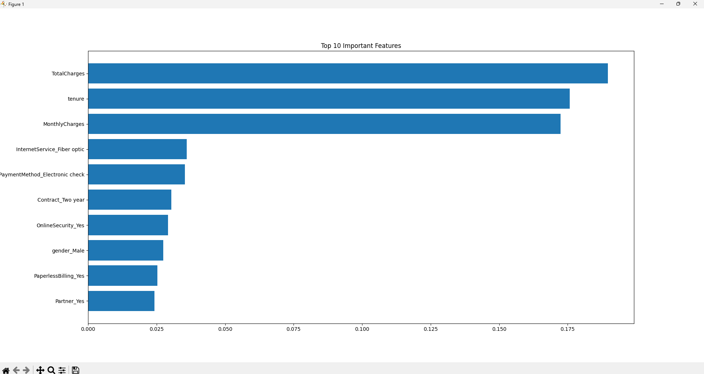

# Customer Churn Prediction Using Machine Learning

## Project Overview

This project predicts whether a customer is likely to leave a telecom service using Machine Learning techniques. The model is trained on the Telco Customer Churn Dataset and deployed through a Streamlit web application.

---

## Features

* Data Cleaning and Preprocessing
* Feature Engineering
* Random Forest Classification Model
* Customer Churn Prediction
* Feature Importance Analysis
* Interactive Streamlit Dashboard

---

## Technologies Used

* Python
* Pandas
* NumPy
* Scikit-Learn
* Matplotlib
* Streamlit
* Joblib
* Git & GitHub

---

## Dataset Information

**Dataset:** Telco Customer Churn Dataset

The dataset contains customer demographic information, account details, service subscriptions, monthly charges, and churn status.

---

## Model Performance

| Metric    | Value                    |
| --------- | ------------------------ |
| Algorithm | Random Forest Classifier |
| Accuracy  | 78.92%                   |

---

## Live Demo

Streamlit App:

https://your-streamlit-app-url.streamlit.app

---

## Project Structure

```text
Customer-Churn-Prediction/
│
├── data/
│   └── WA_Fn-UseC_-Telco-Customer-Churn.csv
│
├── screenshots/
│   ├── home_page.png
│   ├── prediction_result.png
│   └── feature_importance.png
│
├── app.py
├── churn_prediction.py
├── churn_model.pkl
├── feature_names.pkl
├── requirements.txt
└── README.md
```

## Screenshots

### Home Page



### Prediction Result



### Feature Importance



---

## Installation

### Clone the Repository

```bash
git clone https://github.com/Sameera9640/Customer-Churn-Prediction.git
```

### Move into the Project Folder

```bash
cd Customer-Churn-Prediction
```

### Install Dependencies

```bash
pip install -r requirements.txt
```

---

## Run the Application

```bash
streamlit run app.py
```

---

## Author

**N.S. Sameera**

Aspiring Python Developer | Data Science Enthusiast

GitHub:
https://github.com/Sameera9640
